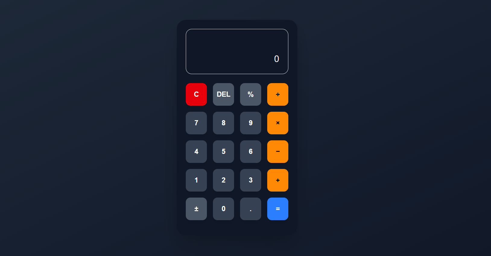

# Rechner-App – Next.js

Eine moderne Rechner-App, entwickelt mit **Next.js**, **TypeScript** und **Tailwind CSS**, die auf **sauberen Architekturprinzipien** basiert.

Die App legt Wert auf **klare Trennung von Logik und UI**, **vorhersehbares State-Management** und **wiederverwendbare Komponenten**, wie sie in professionellen Projekten üblich sind.



---

## Live Demo

**Live auf Vercel:**  
https://taschenrechner-eta.vercel.app/

---

## Funktionen

- Grundrechenarten: Addition, Subtraktion, Multiplikation, Division  
- Prozentrechnung und Vorzeichenwechsel  
- State-Management mit `useReducer` und React Context  
- Saubere Trennung von Logik und Darstellung  
- Wiederverwendbare und leicht testbare Komponenten  
- Modernes, responsives UI mit Tailwind CSS

---

## Architektur & Prinzipien

Die App folgt dem **Container / Presentational Pattern** und enthält:  

- **Dumb & Smart Components** für klare Zuständigkeiten  
- **Reducer-basiertes State-Management** für vorhersehbare Logik  
- **Feature-basierte Ordnerstruktur**  
- **Pure Utility-Funktionen** für Berechnungen

---

## Tech Stack

- **Next.js (App Router)**  
- **React**  
- **TypeScript**  
- **Tailwind CSS**  
- **Vercel** für Deployment

---

## State Management

Der gesamte State wird über `useReducer` und React Context verwaltet:  

- Alle Berechnungslogiken befinden sich im Reducer  
- UI-Komponenten enthalten keine Geschäftslogik  
- Utilities sind isoliert und wiederverwendbar

---

## Persönliche Learnings

- Skalierbare React-Architektur aufbauen  
- Trennung von UI und Geschäftslogik  
- Komplexe UI-States vorhersehbar verwalten  
- Lesbaren und wartbaren Code schreiben

---

## Lokale Installation

```bash
git clone https://github.com/saraAdibi/taschenrechner.git
cd taschenrechner
npm install
npm run dev
```